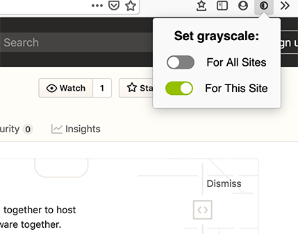
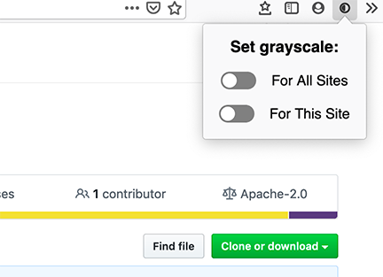

# Grayscale Bro

A minimal Firefox extension for monochrome browsing.

# Features

- Set grayscale filter to all pages
- Set grayscale filter fo a specific hostname

# Known issues

- Some container with `position:fixed` are broken after adding filters